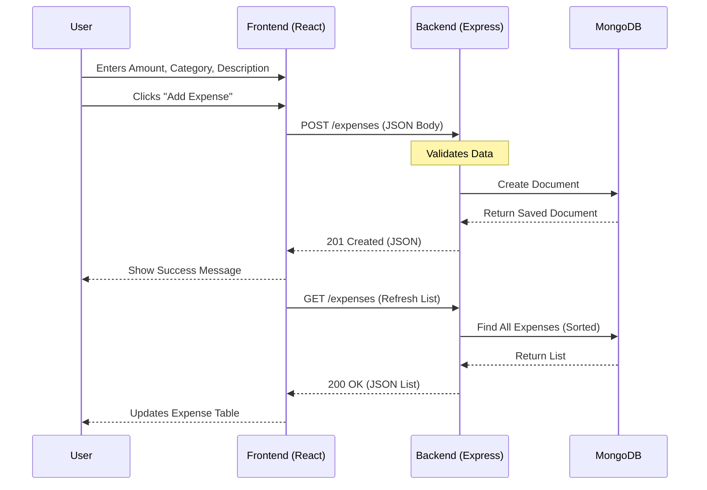

# Expense Tracker

A minimal full-stack expense tracker application built with the **MERN** stack (MongoDB, Express, React, Node.js).

## Tech Stack
- **Backend**: Node.js, Express, MongoDB
- **Frontend**: React, Vite
- **Styling**: Vanilla CSS (Modern, Responsive, with CSS Variables)

## Prerequisites
- Node.js (v14 or higher)
- MongoDB running locally on port 27017

## Setup
1. Clone the repository
2. Install dependencies:
   ```bash
   npm install
   cd server && npm install
   cd client && npm install
   ```

## Running
To run both client and server concurrently:
```bash
npm start
```
- Client runs on http://localhost:5173
- Server runs on http://localhost:5000

---

## Architecture

The application follows a standard Client-Server architecture:

```mermaid
graph LR
    User[User] -->|Interacts| Client[Frontend (React/Vite)]
    Client -->|HTTP Requests| Server[Backend API (Express)]
    Server -->|Mongoose| DB[(MongoDB)]
```

## Application Flow

### Adding an Expense
The following sequence describes how data flows when a user adds a new expense:



---

## Design Decisions & Trade-offs

### 1. Database Choice: MongoDB
- **Decision**: Used MongoDB (NoSQL) instead of a relational DB like SQLite.
- **Reason**: MongoDB provides flexibility with schema design, which is beneficial for quickly iterating on a prototype. It handles JSON-like documents natively, matching the JavaScript backend.
- **Trade-off**: Requires a running database instance (vs a simple file-based SQLite), which slightly increases setup complexity for the user.

### 2. Styling: Vanilla CSS
- **Decision**: Switched from Tailwind CSS to Vanilla CSS.
- **Reason**: To keep the project dependency-free and lightweight. Modern CSS (Variables, Flexbox, Grid) allows for a clean, maintainable design without the build overhead of a framework.
- **Trade-off**: Specific utility classes are not available out-of-the-box; custom classes had to be written for layout and spacing.

### 3. Architecture: Monorepo-style
- **Decision**: Kept `client` and `server` in the same repository.
- **Reason**: Simplifies development and deployment for a small team/project.
- **Trade-off**: Can become unwieldy if the application grows significantly, but perfect for this scale.

## Intentional Omissions (Out of Scope)
- **Authentication**: The app assumes a single-user environment. Multi-user support with JWT/Sessions was omitted to focus on core expense tracking features properly.
- **Complex State Management**: Used React local state (`useState`, `useEffect`) instead of Redux or Context API. The app's state is simple enough that prop drilling is minimal and manageable.
- **Comprehensive Testing**: While manual verification and a backend script were used, a full suite of unit/integration tests (Jest/Cypress) was omitted due to time constraints.
- **Input Validation**: Basic validation exists, but deep data sanitization and schema validation (using Zod/Joi) were kept minimal.

## Deployment

### Vercel Deployment Schema
The project is configured to deploy both frontend and backend to Vercel as a monorepo.
- **Frontend**: Vite app (static assets)
- **Backend**: Express app (Serverless Functions)

### Steps to Deploy
1.  **Database**: Create a MongoDB Atlas cluster and get the connection string (URI).
2.  **Push to GitHub**: Ensure your latest code is on GitHub.
3.  **Import to Vercel**:
    - Go to Vercel Dashboard -> Add New -> Project.
    - Import your GitHub repository.
    - Framework Preset: **Vite** (Vercel should detect it).
    - **Root Directory**: Leave as `./` (Project Root).
4.  **Environment Variables**:
    - Add `MONGO_URI`: Your MongoDB Atlas connection string.
    - Add `VITE_API_URL`: Set this to `/api` (or your full production URL if different).
5.  **Deploy**: Click Deploy.

